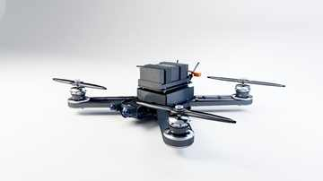

# Twin Engine

Twin Engine is a computational hardware and digital-twin monorepo assembled from the drone, path-tracing, simulation, and mechatronics work developed in this project.

## Visual overview

### AV-7 Swift drone material/detail pass



### Robotic-arm framework pass


### Camera-mount framework pass


### Shoulder-cartridge mechanical section


## Source

The complete curated source tree is stored in [`twin-engine-source.tar.gz`](twin-engine-source.tar.gz). Extract it with:

```bash
./extract-source.sh
```

The archive contains the browsable monorepo layout documented in [`SOURCE_INDEX.md`](SOURCE_INDEX.md):

- `apps/drone` — AV-7 Swift structural and A8 detail generators
- `apps/hardware-platform` — robotic-arm and camera-mount assembly generator
- `apps/digital-twin` — dynamics, controllers, sensors, scenarios, and tests
- `apps/mechatronics` — unified hardware and cartridge generators
- `packages/pathtracer` — custom C++ CPU path tracer
- `docs` and `assets/manifests` — engineering reports and machine-readable outputs

## Pipeline

1. deterministic geometry generation
2. explicit mechanical interfaces and manifests
3. structural, tolerance, and simulation checks
4. offline path-traced delivery

## Policy

Large PFM caches, transient frame directories, duplicated ZIPs, and known-invalid prototype outputs are excluded. The repository preserves the curated source, engineering documentation, and compact manifests.

## Engineering boundary

These are research and engineering baselines, not certified production hardware.
